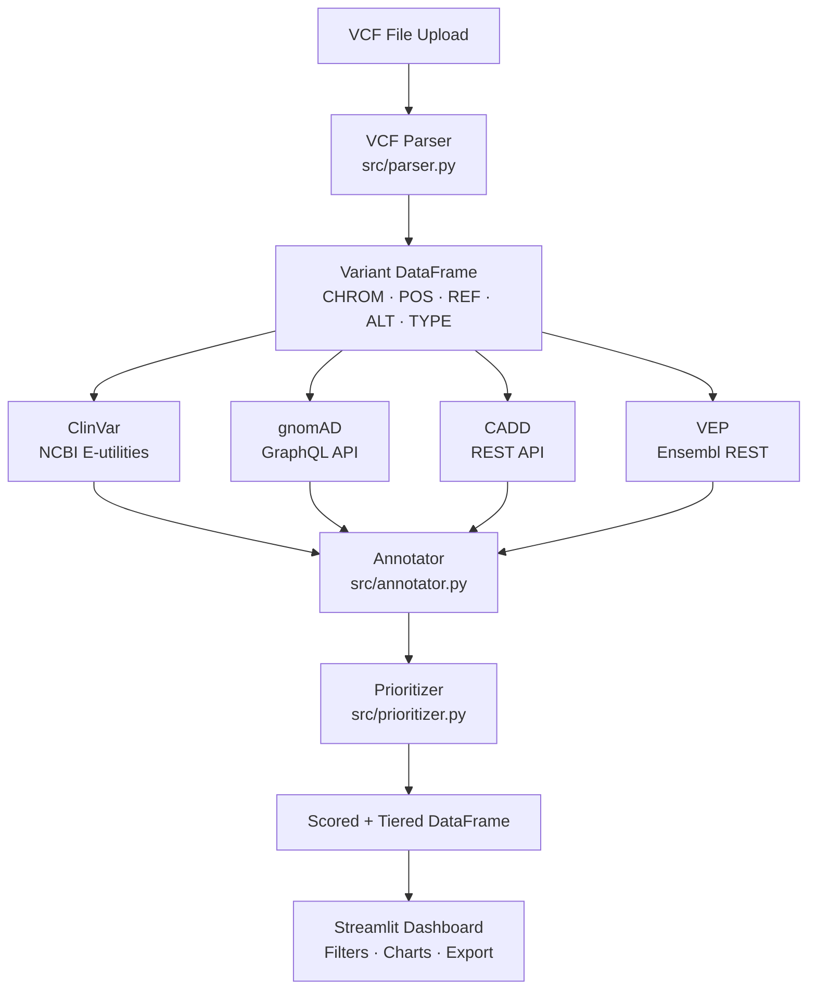

# Clinical Variant Annotation Pipeline

> Annotates raw VCF variants against four clinical databases and ranks them by pathogenicity so researchers can focus on the variants most likely to cause disease.

**Built with:** Python, Streamlit, Plotly, pandas, ClinVar API, gnomAD GraphQL, CADD API, Ensembl VEP REST

---

## The Problem

Whole-genome or exome sequencing produces thousands of variants per patient — the vast majority benign. Identifying the clinically significant ones requires cross-referencing multiple specialized databases (NCBI ClinVar, gnomAD, Ensembl VEP, CADD), each with a different API, data model, and scoring convention. Doing this manually takes hours of bioinformatics work per sample and requires deep domain knowledge most clinical teams do not have on hand.

---

## What I Built

The pipeline takes a raw VCF file, parses it into a structured dataframe, fans out to four external annotation APIs in sequence, computes a composite priority score for each variant, and surfaces the results through an interactive Streamlit dashboard with filters and CSV export.

- **VCF Parser** ([src/parser.py](src/parser.py)) — reads standard VCF format, strips header lines, extracts CHROM/POS/REF/ALT/QUAL/FILTER, classifies each variant as SNV, deletion, or insertion, and assigns a stable `CHROM-POS-REF-ALT` identifier.
- **Annotator** ([src/annotator.py](src/annotator.py)) — four discrete annotation functions, each targeting a separate API:
  - `annotate_with_clinvar` — queries NCBI E-utilities (`esearch`) to check whether the variant appears in ClinVar.
  - `annotate_with_gnomad` — queries the gnomAD GraphQL API (`gnomad_r2_1` genome dataset) to retrieve allele frequency (AC/AN/AF).
  - `annotate_with_cadd` — calls the CADD REST API to retrieve the PHRED-scaled pathogenicity score.
  - `annotate_with_vep` — calls the Ensembl VEP REST API to retrieve consequence type (e.g., `frameshift_variant`, `missense_variant`) and gene symbol.
- **Prioritizer** ([src/prioritizer.py](src/prioritizer.py)) — combines the four annotations into a 0–120 composite score and assigns a tier (Critical ≥ 80, High 50–79, Medium 30–49, Low < 30).
- **Dashboard** ([app.py](app.py)) — Streamlit UI with file upload, progress tracking, sidebar filters (tier, gene, ClinVar status, max population frequency), three Plotly charts, a color-coded results table, and one-click CSV export.

---

## Key Technical Decisions

**Why a composite numeric score instead of rule-based triage?**
Any single signal is noisy: a ClinVar-listed variant might be common in the population (likely benign), and a novel variant might have a high CADD score but a low-impact consequence. Combining four orthogonal signals — database presence, population rarity, computational pathogenicity, and molecular consequence — into an additive score allows partial evidence to accumulate and produces a continuous ranking rather than a hard binary. The weights (ClinVar presence: +30, gnomAD rarity: up to +30, CADD: up to +30, consequence severity: up to +30) reflect relative clinical utility and were tuned to match standard variant classification frameworks (ACMG/AMP).

**Why gnomAD GraphQL instead of a local frequency file?**
gnomAD's reference genome population data is ~30 GB compressed. For a tool that processes ad hoc uploads rather than a continuous batch pipeline, fetching on-demand via the gnomAD GraphQL API is the right tradeoff: no infrastructure to maintain, always current with the latest gnomAD release, and zero storage cost. The consequence is per-variant latency, which is acceptable for the expected VCF sizes (dozens to low hundreds of variants in a clinical context).

**Why Streamlit instead of a standalone REST backend?**
The target users are biologists and clinical researchers, not engineers. Streamlit collapses the gap between the Python pipeline and a usable interface: the same process that runs the annotation logic also serves the UI, with no API contract, serialization layer, or deployment complexity to manage. The tradeoff — limited UI customization and single-user concurrency — does not matter at this scale.

**Why separate annotation functions rather than a single multi-API call?**
Each external API has different failure modes, timeouts, and response formats. Isolating them means a CADD timeout does not abort the ClinVar or VEP annotations. Each function falls back gracefully (`-1` or `"error"`) and the prioritizer handles missing values explicitly, so partial annotation still produces a usable (if lower-confidence) score.

---

## Results & Metrics

- 4 external clinical databases integrated into a single ranked output from one VCF upload
- Priority tiers (Critical/High/Medium/Low) reduce thousands of variants to an actionable shortlist in seconds
- Composite score replaces manual cross-referencing across NCBI, Broad Institute, Washington University, and Ensembl portals
- CSV export with all raw annotation fields enables downstream analysis in any tool

---

## Architecture



---

## Stack

| Layer | Technology |
|---|---|
| UI | Streamlit |
| Visualization | Plotly Express |
| Data Processing | pandas |
| HTTP Client | requests |
| Clinical DB | ClinVar via NCBI E-utilities |
| Population Frequency | gnomAD r2.1 GraphQL API |
| Pathogenicity | CADD REST API (UW) |
| Consequence Annotation | Ensembl VEP REST API |
| Input Format | VCF (Variant Call Format) |

---

## Setup

**Prerequisites:** Python 3.8+

```bash
git clone <repo>
cd clinical-variant-annotation
python -m venv venv
source venv/bin/activate        # Windows: venv\Scripts\activate
pip install -r requirements.txt
streamlit run app.py
```

Open `http://localhost:8501`, upload a VCF file (or check "Use sample file"), then click **Run Annotation Pipeline**.

---

## Where This Fits

Variant annotation sits at the intersection of sequencing and clinical interpretation — after raw reads are aligned and variant-called, but before a clinician or researcher can act on the findings.

```
Sample Collection → Sequencing → Alignment → Variant Calling → [ANNOTATION & PRIORITIZATION] → Clinical Interpretation → Report
                                                                           ↑
                                                                       this pipeline
```

It is relevant anywhere VCF files are produced: germline rare-disease diagnosis, somatic tumor profiling, pharmacogenomics panels, and research cohort studies.

---

## Production Considerations

- **Rate limiting and API keys** — ClinVar E-utilities, gnomAD, CADD, and Ensembl all impose rate limits on anonymous requests. A production deployment would register for API keys, implement exponential backoff, and batch requests where the APIs support it (VEP accepts up to 200 variants per POST request).
- **Local database snapshots** — for high-throughput or offline use, gnomAD AF and CADD scores should be pre-downloaded and served from a local database (PostgreSQL + indexed TSV or a VCF lookup service) rather than queried per-variant.
- **HIPAA / data privacy** — VCF files from clinical patients are protected health information. A production system must not transmit them to third-party APIs; all annotation would need to run against local database mirrors.
- **Concurrency** — the current sequential per-variant API loop is the primary bottleneck. Production throughput requires async I/O (`asyncio` + `aiohttp`) or multiprocessing to parallelize the four annotation calls per variant.
- **Genome build consistency** — the ClinVar query uses GRCh37 coordinates (`chrpos37`) while VEP defaults to GRCh38. A production pipeline must enforce a single reference build throughout or perform liftover before annotation.
